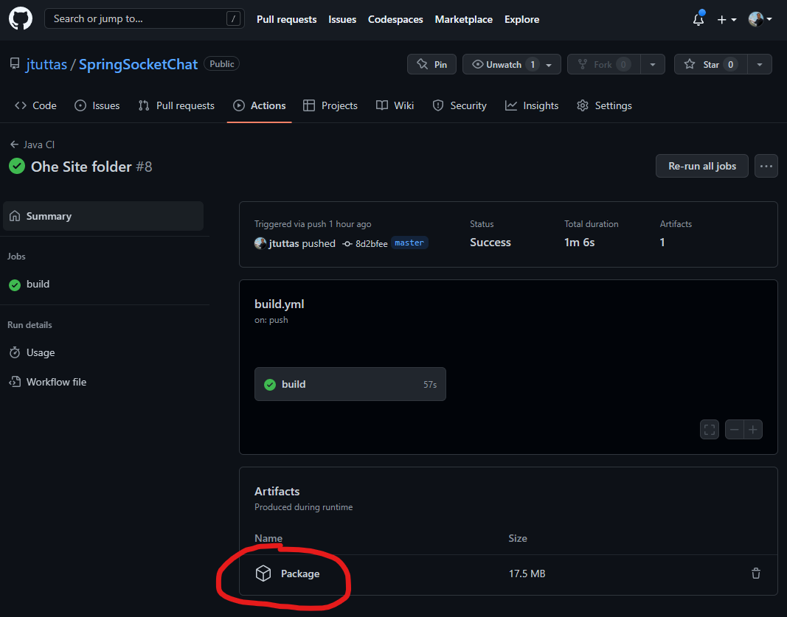
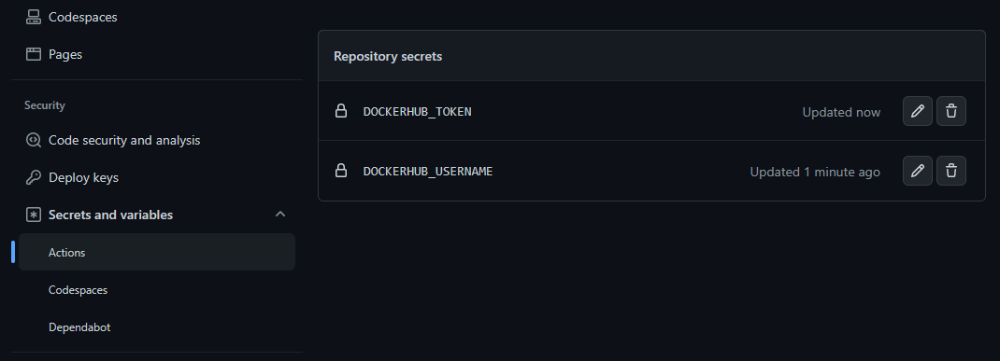
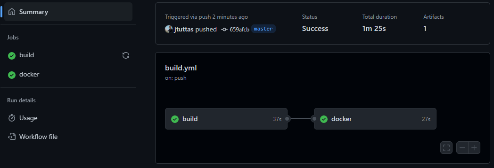
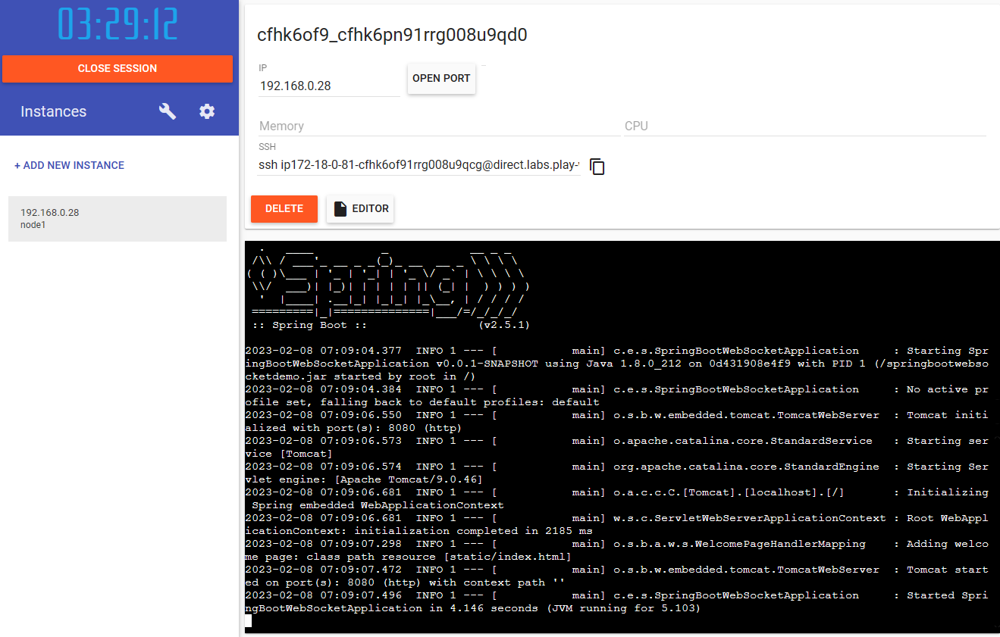

# Automatisierung mittels GitHub Actions

## Bauen der Anwendung

Das Bauen der Anwendung kann auch mittels github Actions automatisch auf Github erfolgen. Dazu muss eine **.yml** Datei ind das Verzeichnis **.github/workflows** aktiviert haben. Zahlreiche Actions sind bereits entwickelt, so auch die zum Packen eines Maven Projektes.

Nach einem Commit auf das Repository kann die Anwendung als **jar** File herunter geladen werden.

## Bauen des Docker Images

Ebenso kann der Docker Container der Anwendung automatisch via einer GitHub Action gebaut werden. Zum Speichern des Images wird dazu eine Registry verwendet. Default wird die Registry von **docker.io** benutzt.

Die Notwendigen Credentials für das Einloggen auf dem Docker Hub werden in Github hinterlegt.

Bei einem Push auf den master Branch kann man den Ablauf des Workflows auf github beobachten.

Nun kann man auf jedem Rechner auf dem Docker installiert ist die Anwendung Starten, z.B. bei [Play With Docker](https://labs.play-with-docker.com/).

