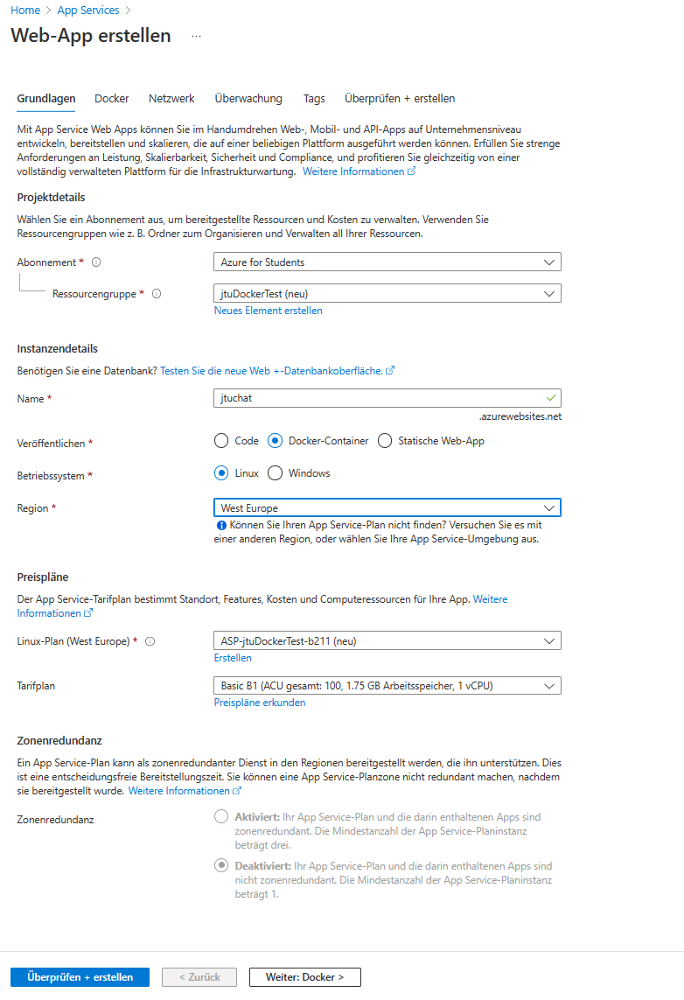
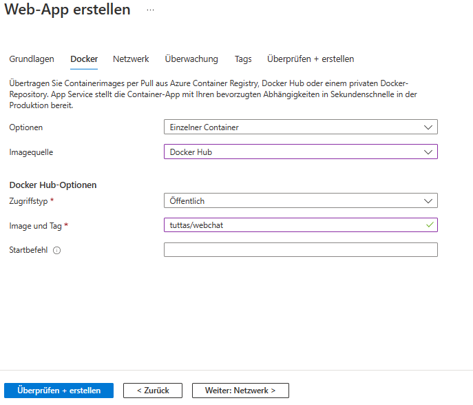
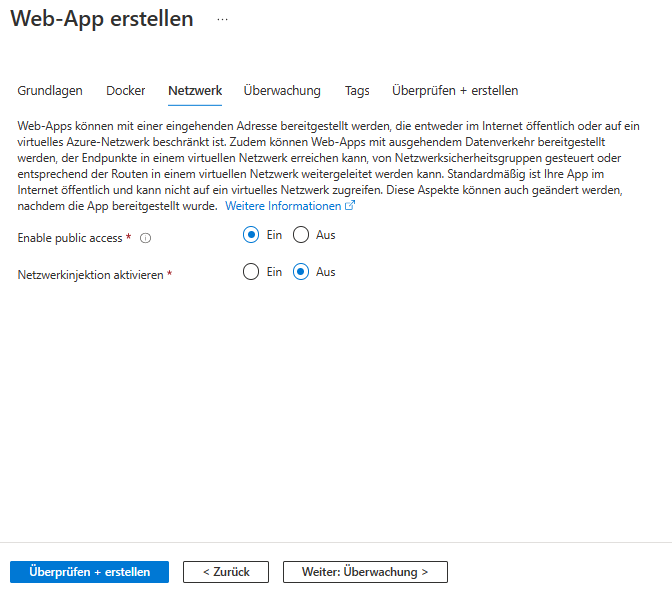
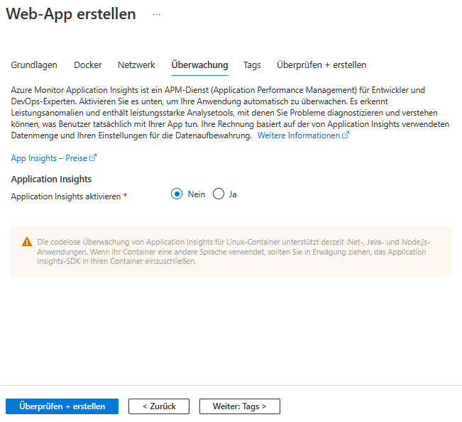
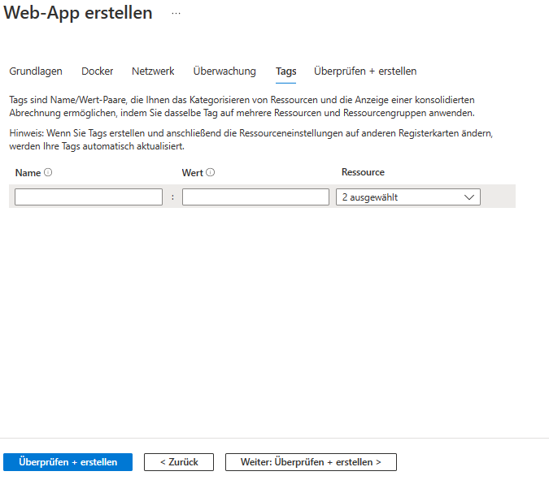
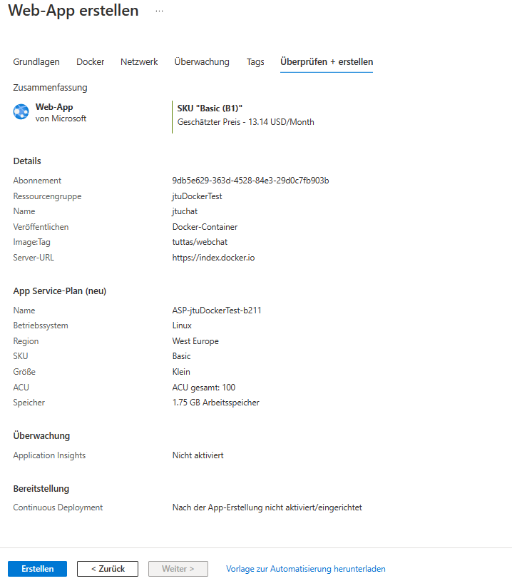
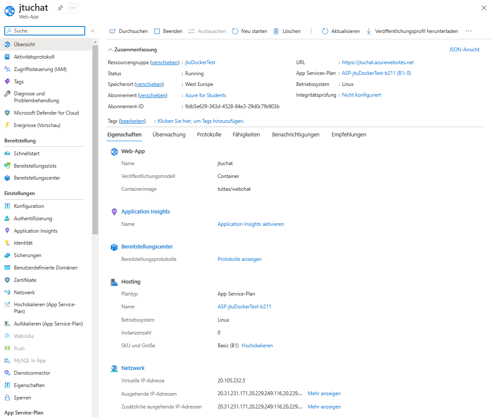
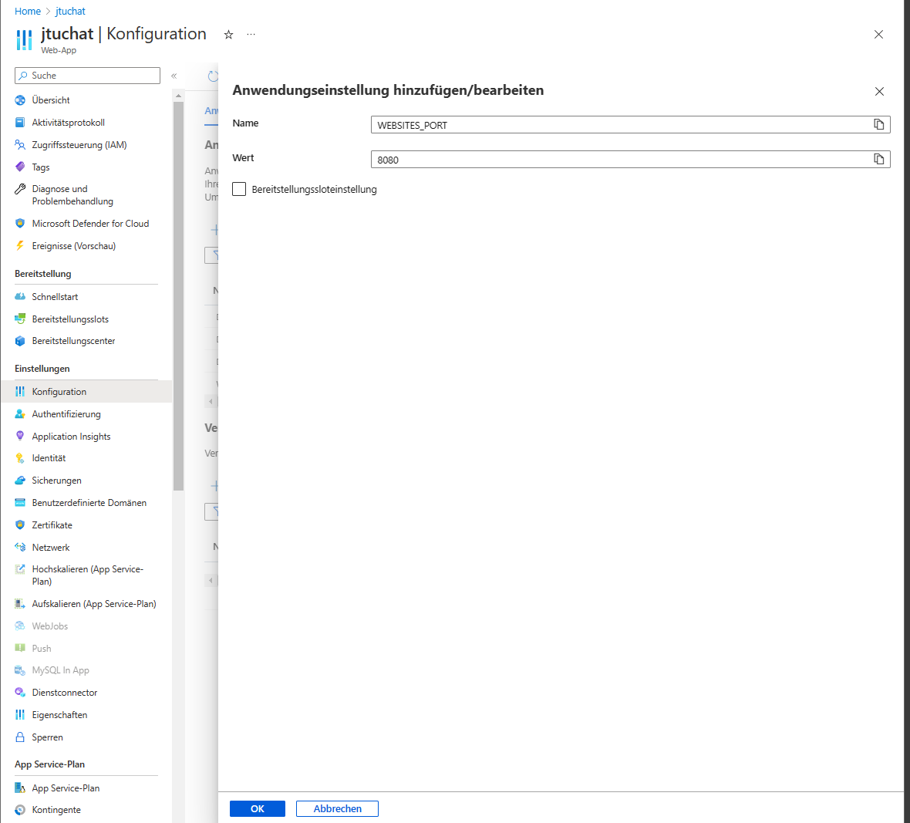
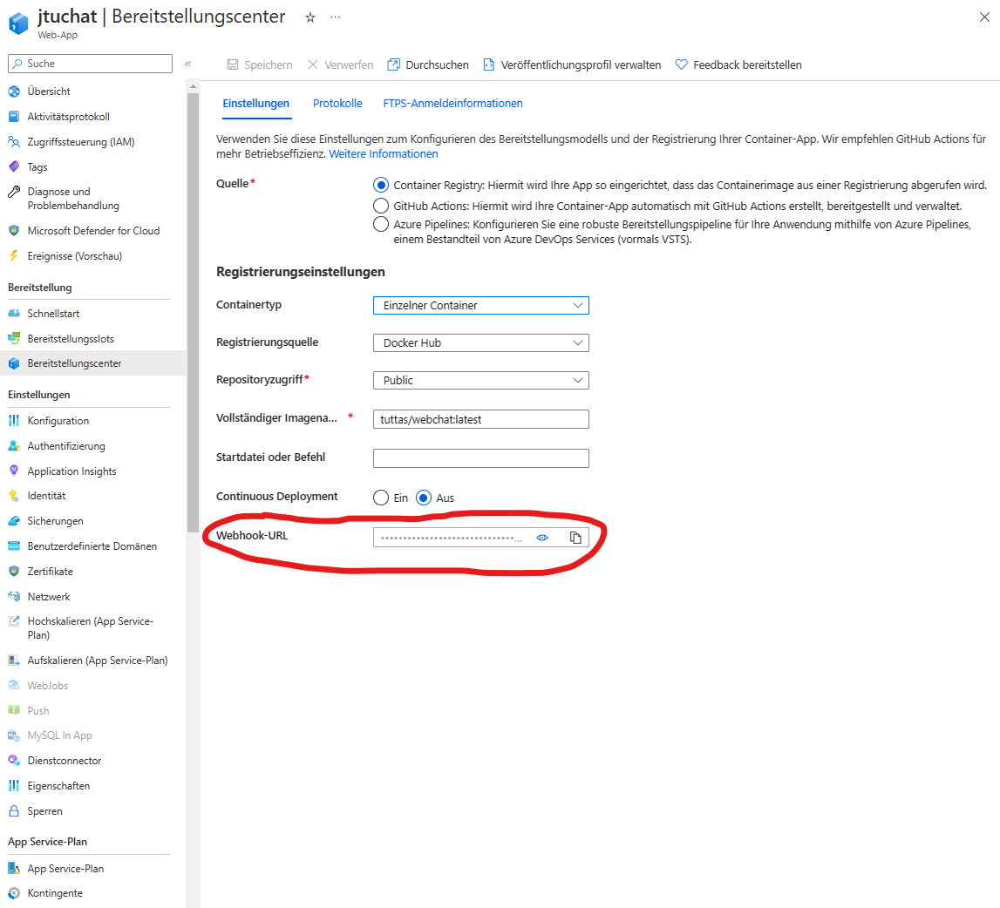
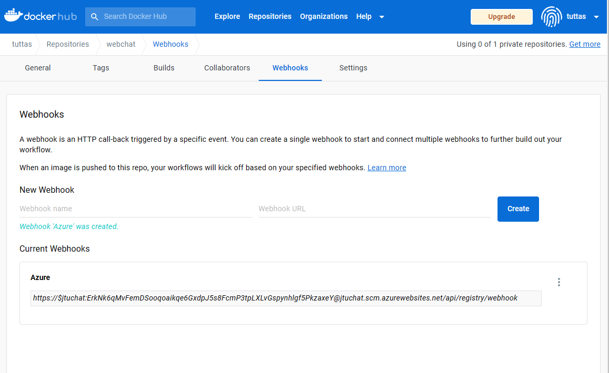

# Hosten bei Azure

Im nächsten Schritt soll der Container bei Azure gehostet werden. Dazu muss nach der Anmeldung bei Azure hier eine Azure App Service erstellt werden.

## Erstellen einer Web App

Anschließend erhält man eine Übersicht der Web App und auch schon eine URL unter der diese aufgerufen werden kann.

## Konfigurieren der Web App

Über den Menüpunkt Konfiguration muss man nun noch den entsprechenden Port öffnen. Dieses geschieht dadurch, dass man Hier den Key **WEBSITES_PORT** und als Value den Port einträgt, hier **8080**.

## Einrichten des Web Hooks

Über den Menüpunkt Bereitstellungszenter muss nun der **Webhook** konfiguriert werden. Diesen Webhook muss nun in die Zwischenablage kopiert werden, um ihn Docker bekannt zu machen.

Hierzu muss sich auf dem Docker Hub angemeldet werden und im Reiter Webhooks die Adresse aus Azure eingefügt werden. Damit benachrichtigt der Docker Hub Azure, wenn eine neue Version des Images erzeugt wurde.

## Automatisieren mit Powershell
