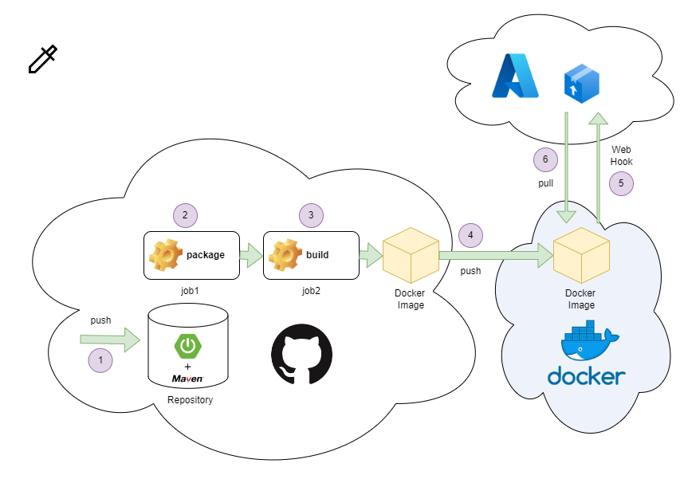
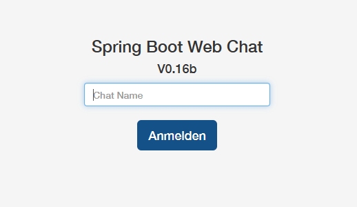

# CI/CD mit github Action, Docker und Azure

Im Folgenden wollen wir ein Java Maven Projekt über einen GitHub Workflow in einen Docker Image veröffentlichen und dieses dann als Container auf Azure starten.




## Das Software Projekt

Dieses Java Programm realisiert eine Chat-App basierend auf dem Spring boot Framework. Soll die Anwendung lokal gestartet werden, so muss auf dem lokalen Server natürlich **JAVA** als Laufzeitumgebung und **Maven** als Build-Tool installiert sein.

Nach dem Klonen des Repositories wechselt man in das Verzeichnis und ruft MAVEN auf:

```
mvn package
```

Anschließend wird...

- das Projekt kompiliert
- die Abhängigkeiten werden aufgelöst
- JUNIT Tests werden durchgeführt
- Das Programm zu einem **jar** Datei gepackt.

Die **jar** Datei befindet sich im Ordner ./target. Daher kann die Anwendung mittels folgenden Befehl gestartet werden.

```
java -jar target\spring-boot-web-socket-0.0.1-SNAPSHOT.jar
```

Nach einer kurzen Wartezeit kann die Anwendung über einen Browser unter **http://localhost:8080** aufgerufen werden.



## Der Docker Container

Dieses ist natürlich alles sehr umständlich und daher ist es eine gute Idee das Projekt in einen Docker Container zu packen. Im Hauptordner befindet sich bereits ein entsprechendes **Dockerfile** und man kann das Image bauen über:

```
docker build -t tuttas/webchat .
```

Anschließend kann der Docker Container gestartet werden über:

```
docker run -p 8080:8080 tuttas/webchat
```

